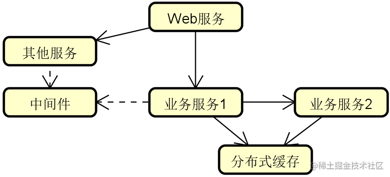
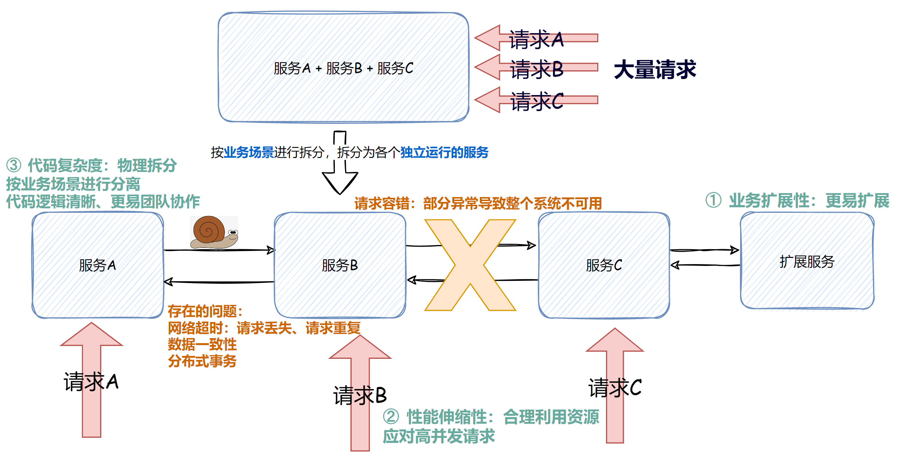
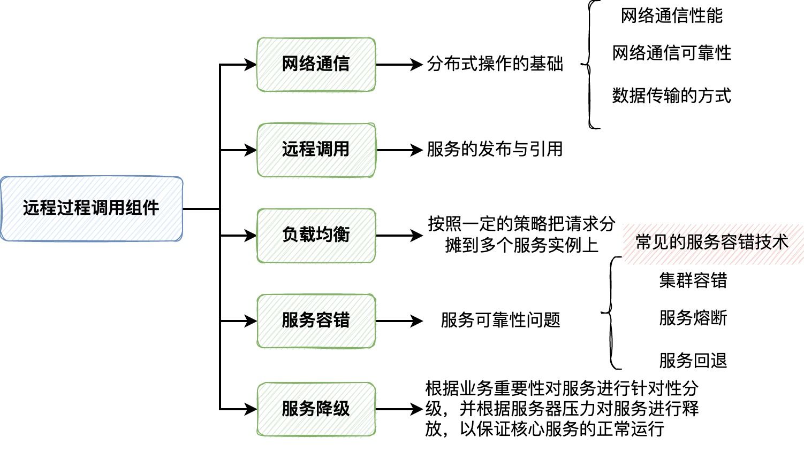
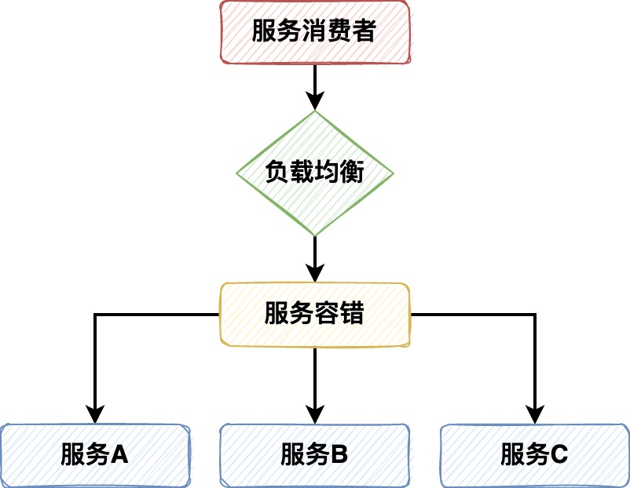
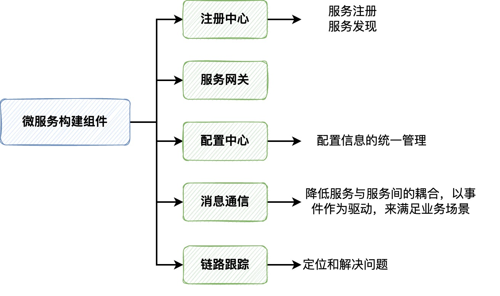

## [分布式服务精讲](https://s.juejin.cn/ds/raAq22D/)

## 1. 为什么需要分布式系统？
### 1.1 单体系统面临的问题

1. 业务扩展性: 任何改动都需要对整个系统进行重新发布，而且面对需求的变动，代码改动程度越大，扩展性就越差
2. 代码复杂度: 简单来说可以说成是代码边界不清晰，随着需求的增加，系统的迭代，单体系统的复杂度提高，维护成本增加
3. 性能的可伸缩性: 或者说是对服务器资源的有效利用，由于单体应用所有的代码和服务都在一台服务器上，通过服务器扩容比较难实现对资源的充分利用

### 1.2 分布式系统

区别于单体系统，分布式系统会将系统拆分成多个能够独立运行的服务，这些服务在物理上是隔离的，相互之间基于网络进行通信

拆分成了多个服务后：
1. 业务的扩展性：修改哪些服务的代码重新发布对应的服务即可，代码改动程度能够只局限在单个服务
2. 代码复杂度: 服务代码的边界清晰，相比于单体系统在需求的迭代上，维护成本较低
3. 性能的伸缩性: 服务在物理上隔离，也就可以区分开CPU密集型和内存密集型的代码，通过扩容提高对服务器资源的利用更加显著
4. 流量的分散: 相比于单体系统请求全部打到一台服务器上，分布式服务能够将针对不同的请求进行分散
5. 团队合作: 分工可以更明确

### 1.3 带来优越性的同时也带来了问题

1. 通信延迟: 在单体系统中，服务的调用只有成功、失败两种情况，但是在分布式系统中，还会出现**超时**的情况，超时不能简单的看作失败，
要根据具体的场景进行分析，**避免出现请求丢失和重复请求的情况**，而且在网络延迟下，用户体验也是需要考虑的问题
2. 调用链路复杂: 分布式系统相比于单体系统更加容易出错，而且调用链路更长、更复杂，这就需要对服务间失败的调用进行管理，以免导致整个系统的不可用。
针对调用链路还需要进行链路监控。
3. 数据的一致性: 分布式事务问题，不同服务有不同的数据库，那么在业务执行中，保证数据的一致性也需要被解决

## 2. 分布式系统技术组件
### 2.1 远程过程调用组件

### 2.2 微服务构建组件

